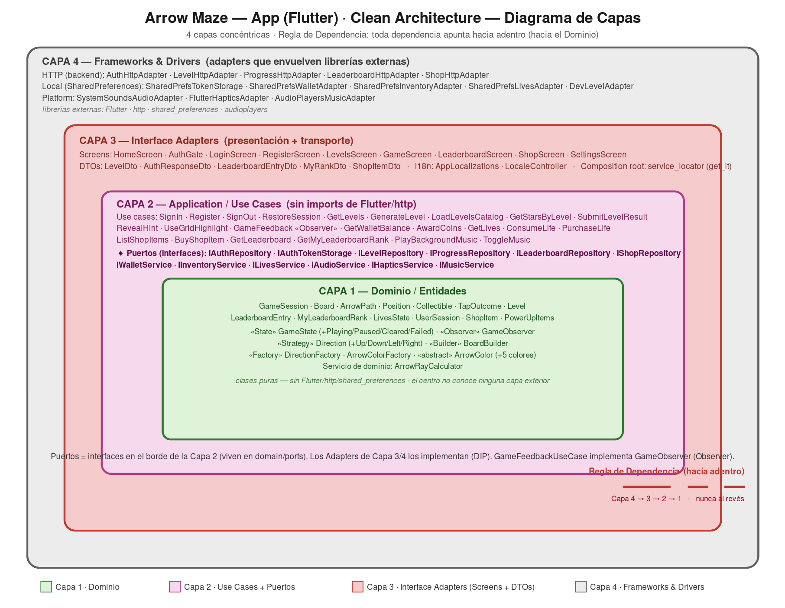

# Arrow Maze — Flutter App


Mobile puzzle game: clear a board of arrows by tapping them in the right order. Each arrow fires a ray in its direction; a tap is valid only if that ray reaches the board edge without hitting another arrow or wall. Clear every arrow within the move budget to win the level and earn stars.

Companion client of the [`arrow-maze-backend`](https://github.com/faleon24/arrow-maze-backend) NestJS API (auth, level catalog, progress, leaderboard, shop).

---

## Demo

| Home | Level catalog | Puzzle board | Shop |
|---|---|---|---|
| _screenshot_ | _screenshot_ | _screenshot_ | _screenshot_ |

> Screenshots live in [`docs/screenshots/`](docs/screenshots). Release APK: see the [Releases page](https://github.com/faleon24/arrow-maze-app/releases).

---

## Architecture

Hexagonal (ports + adapters) with a `get_it` service locator as composition root. Four layers, one dependency direction.



```
lib/
  main.dart                       # composition root: setupDI(); runApp(...)
  core/
    di/service_locator.dart       # every getIt binding (Singleton registry)
  domain/
    models/                       # pure entities + value objects + GoF patterns
    ports/                        # interfaces (framework-agnostic)
    services/                     # pure domain logic (ray calculator, solver)
  application/
    usecases/                     # orchestrators over ports
      auth/ level/ progress/ game/
      wallet/ lives/ shop/ leaderboard/ music/
  infrastructure/
    adapters/
      http/                       # NestJS backend clients
      local/                      # SharedPreferences persistence
      platform/                   # Flutter services (haptics, audio, music)
    dto/                          # transport shapes + toDomain() mappers
  presentation/
    screens/                      # StatefulWidgets, resolve deps via getIt<T>()
    widgets/                      # visuals (BoardPainter, CellWidget)
    auth_guard.dart               # global 401 -> sign-out handler
```

**Dependency rule:** `presentation → application → domain` and `infrastructure → domain`. The `domain` and `application` layers never import `package:flutter`, `package:http`, or `package:shared_preferences`. Enforced by grep sanity checks in every architectural commit. A full class diagram lives at [`docs/class_diagram.png`](docs/class_diagram.png).

---

## Design Patterns (GoF)

Four Gang-of-Four patterns are implemented on the client. The backend implements four more (see its README).

| Pattern | Role in this app | Source |
|---|---|---|
| **Adapter** | Every port is realized by a swappable adapter across three transport families: HTTP, local persistence, platform services. | [`infrastructure/adapters/http/`](lib/infrastructure/adapters/http), [`local/`](lib/infrastructure/adapters/local), [`platform/`](lib/infrastructure/adapters/platform) |
| **Singleton** | `get_it` holds one shared instance per binding; stateful adapters (token storage, wallet, lives) are registered as singletons so state is consistent app-wide. | [`core/di/service_locator.dart`](lib/core/di/service_locator.dart) |
| **Builder** | `BoardBuilder.fromJson` assembles an immutable `Board` (cells, arrow paths, collectibles) step by step from transport data. | [`domain/models/board_builder.dart`](lib/domain/models/board_builder.dart) |
| **Observer** | `GameSession` is the Subject; `GameObserver` implementations subscribe to lifecycle + feedback events (audio, haptics, UI counters) without the session knowing its listeners. | [`domain/models/game_observer.dart`](lib/domain/models/game_observer.dart), [`game_session.dart`](lib/domain/models/game_session.dart) |
| **State** | `GameState` hierarchy — Playing / Paused / Cleared / Failed — encapsulates per-state behavior and legal transitions instead of boolean flags. | [`domain/models/game_state.dart`](lib/domain/models/game_state.dart) |

---

## SOLID Principles

Concrete example per principle, each pointing to real code.

- **Single Responsibility** — Each use case does exactly one thing. [`sign_in_usecase.dart`](lib/application/usecases/auth/sign_in_usecase.dart) only authenticates; awarding coins for a cleared level is a separate [`award_coins_for_level_usecase.dart`](lib/application/usecases/wallet/award_coins_for_level_usecase.dart). Changing coin rules never touches auth.
- **Open/Closed** — Adding a new persistence backend means writing a new adapter that implements an existing port (e.g. a future `FirestoreLevelAdapter` implementing [`level_repository.dart`](lib/domain/ports/level_repository.dart)); no use case or existing adapter is modified.
- **Liskov Substitution** — `LevelHttpAdapter` and `DevLevelAdapter` both satisfy [`level_repository.dart`](lib/domain/ports/level_repository.dart) and are interchangeable at the DI seam; the `USE_DEV_LEVELS` flag swaps one for the other with zero call-site changes.
- **Interface Segregation** — Ports are fine-grained rather than one fat service: [`audio_service.dart`](lib/domain/ports/audio_service.dart), [`haptics_service.dart`](lib/domain/ports/haptics_service.dart), and [`music_service.dart`](lib/domain/ports/music_service.dart) are separate, so a consumer that only needs haptics never depends on audio.
- **Dependency Inversion** — Use cases depend on port abstractions in `domain/ports`, never on concrete adapters. Concretions are injected at the composition root [`core/di/service_locator.dart`](lib/core/di/service_locator.dart).

---

## AOP — Aspect-Oriented Programming

Cross-cutting concerns (audio, haptics, UI feedback) are kept out of core game logic and attached as **Observers** on `GameSession`, so gameplay code stays pure while feedback is woven in from the edges. On the backend, cross-cutting logging/security/caching is applied with the **Decorator** pattern (no framework interceptors) — see the backend README's AOP section.

---

## Features

- Email/password auth, JWT persisted in SharedPreferences (session expiry validated locally on launch)
- Level catalog with server-side stars per level, cross-referenced against the signed-in player
- Puzzle board with continuous arrow paths (bent L/U/S/zigzag shapes), tap-to-fire ray mechanics
- Pinch-to-zoom + two-finger pan on the board (`InteractiveViewer`)
- Star collectibles that render on the board and are picked up during a run
- Haptic + audio SFX + looping background music, each individually mutable in Settings
- Power-ups: hint (reveal an activatable arrow) and grid highlight (show an arrow's ray without firing)
- Coin wallet + inventory persisted locally, server-adapter-ready
- Global lives system: −1 life per failed or abandoned run, purchasable with coins
- Level-unlock progression gated on prior-level stars
- Pause + visible elapsed timer, per-level leaderboard
- On-demand "Generate more levels" hitting the backend generator

---

## Getting started

Requires Flutter SDK 3.x and a connected device or emulator.

```bash
git clone git@github.com:faleon24/arrow-maze-app.git
cd arrow-maze-app
flutter pub get
```

Run with the bundled dev fixture (no backend needed):

```bash
flutter run --dart-define=USE_DEV_LEVELS=true
```

Run against the backend (default):

```bash
flutter run                                                # http://localhost:3000/api
flutter run --dart-define=API_URL=https://api.example.com  # any URL
```

The backend must be running for level fetch and progress. See the [backend README](https://github.com/faleon24/arrow-maze-backend#readme).

---

## Running tests

```bash
flutter analyze              # must show 0 issues
flutter test                 # domain + application + infrastructure + fixtures
```

117 tests across `test/domain/`, `test/application/`, `test/infrastructure/`, `test/fixtures/`. CI runs `flutter analyze` + `flutter test` on every push and pull request (see [`.github/workflows/ci.yml`](.github/workflows/ci.yml)).

---

## Compile-time flags

| Flag | Effect |
|---|---|
| `USE_DEV_LEVELS=true` | Binds `ILevelRepository` to the bundled fixture instead of HTTP |
| `API_URL=<url>` | Base URL for backend calls (default `http://localhost:3000/api`) |

Both consumed via `String.fromEnvironment` / `bool.fromEnvironment` inside `ApiConfig` and `setupDI`.

---

## Project conventions

- Conventional Commits in English; each feature on its own branch, merged with `--no-ff`
- Tests in AAA style with `should_x_when_y` naming
- No enums (whitelisted string constants when discrimination is needed)
- Domain and application layers stay framework-agnostic

---

## AI usage

Development made heavy use of AI assistance, logged transparently with a critical evaluation in [`AI_USAGE.md`](AI_USAGE.md).

## License

MIT — see [`LICENSE`](LICENSE).
